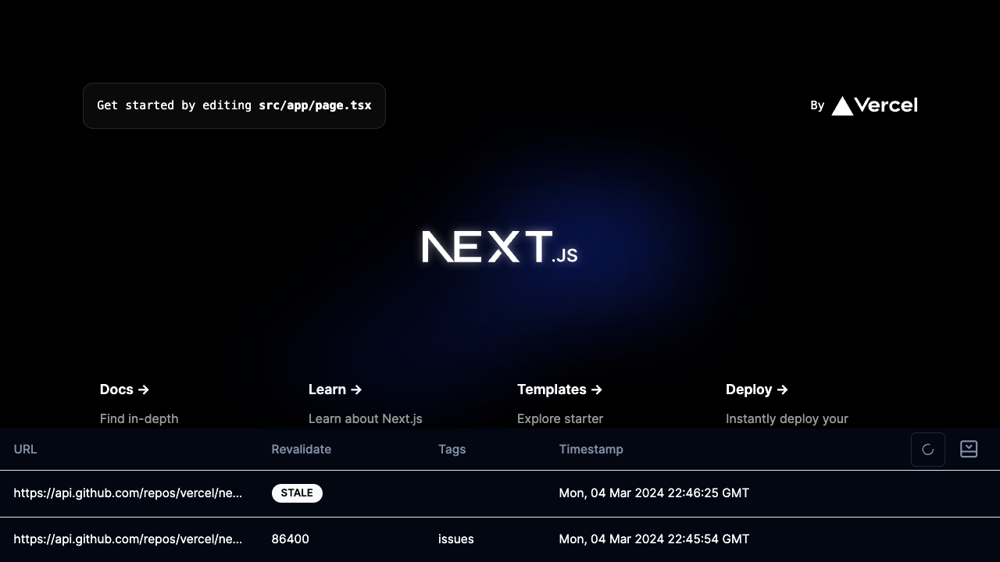

# next-cache-toolbar  [](https://www.npmjs.com/package/next-cache-toolbar)

A toolbar that helps to identify [data cache](https://nextjs.org/docs/app/building-your-application/caching#data-cache) entries



## Use 

`next-cache-toolbar` requires to use [app router](https://nextjs.org/docs/app/building-your-application/caching#data-cache) and [next-themes](
You'll need to update your `app/layout.jsx` to use next-themes. The simplest `layout` looks like this:

```js
// app/layout.jsx
import "next-cache-toolbar/style.css";

export default function Layout({ children }) {
  return (
    <html>
      <head />
      <body>
        {children}
        {process.env.NODE_ENV === "development" && <NextCacheToolbar />}
      </body>
    </html>
  )
}
```

