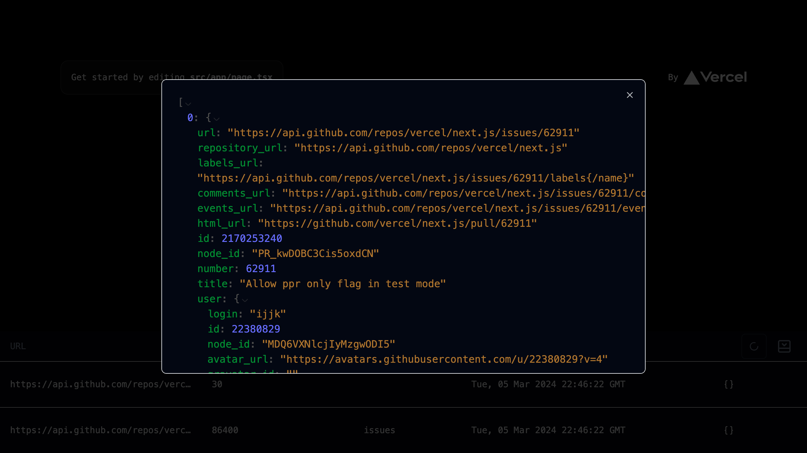

# next-cache-toolbar [](https://www.npmjs.com/package/next-cache-toolbar)

A toolbar that helps to identify [data cache](https://nextjs.org/docs/app/building-your-application/caching#data-cache) entries




## How to use it?

`next-cache-toolbar` requires to use [app router](https://nextjs.org/docs/app/building-your-application/caching#data-cache)

Create file that we will lazy loading later to avoid bundling `next-cache-toolbar` in production
```jsx
// app/toolbar.jsx
import { NextCacheToolbar } from "next-cache-toolbar";
import "next-cache-toolbar/style.css";

export default function Toolbar() {
	return <NextCacheToolbar />;
}
```


```jsx
// app/layout.jsx
let Toolbar: React.ComponentType = () => null;

if (process.env.NODE_ENV === "development") {
	Toolbar = dynamic(() => import("./toolbar"));
}

export default function Layout({ children }) {
  return (
    <html>
      <head/>
      <body>
        {children}
        <Toolbar />
      </body>
    </html>
  );
}
```

## How does `data cache` work?

There are two cases when `data cache` is used:
 - wrapping any function with `unstable_cache`
 - adding `next` options to `fetch` call

Both cases will store returned data inside `.next/cache/fetch-cache` folder in format 

```json
{
  "kind": "FETCH",
  "revalidate": 30,
  "tags": [],
  "data": {
    "body": "...",
    "headers": {},
    "status": 200,
    "url": "..."
  }
}
```

There is one caveat, when using `unstable_cache` stored data will do not have any headers while body will be in plain JSON.
But when using `fetch` with `next` options all headers from response will be present and `body` will be encoded using base64.
Nevertheless both of these approaches stores all data as well as `revalidate` time and `tags`.

File are named randomly and do not contain any extension.

